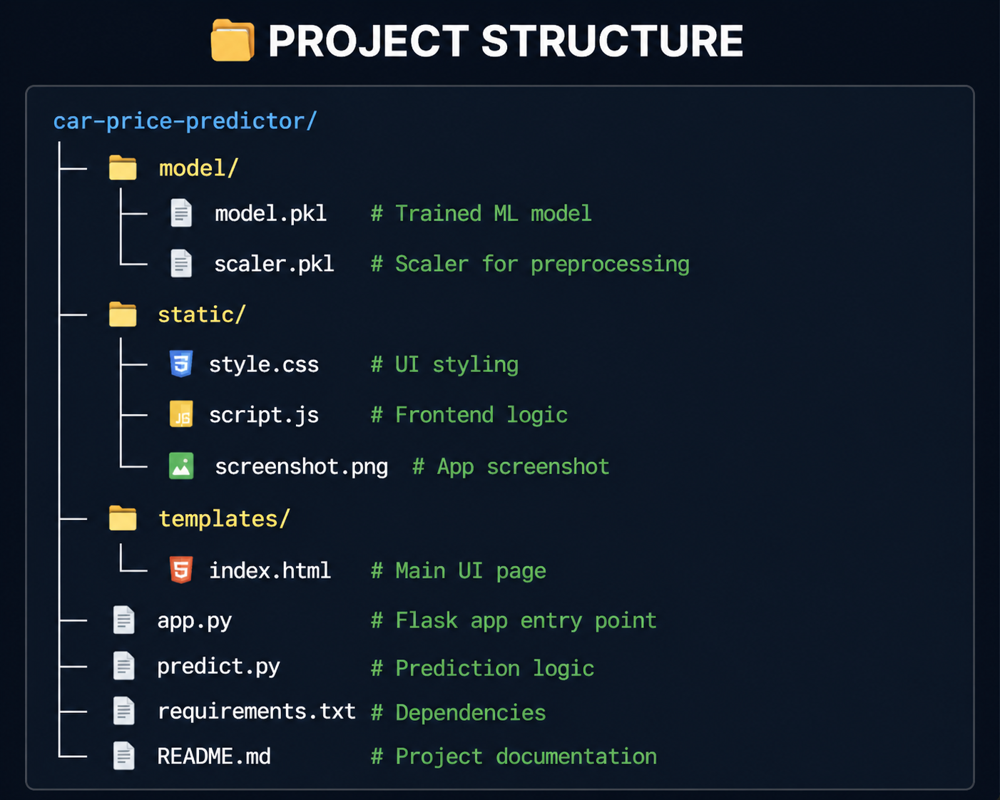
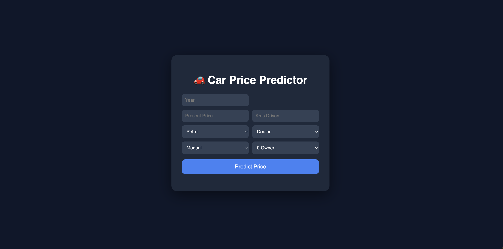

# 🚗 Car Price Predictor

## 📌 Project Overview
This is a **Machine Learning-based Web Application** that predicts the selling price of a used car based on various input features.

The system uses a trained regression model and a Flask-based web interface to provide real-time predictions.

## 🏗️ Project Structure

  

---

## ⚙️ Features
- 🔮 Predict car price instantly
- 🎯 Clean and user-friendly UI
- ⚡ Fast predictions
- 📊 Supports multiple inputs:
  - Year
  - Present Price
  - Kms Driven
  - Fuel Type
  - Seller Type
  - Transmission
  - Owner

---

## 🧠 Machine Learning Model
- Algorithms Used:
  - Linear Regression
  - Random Forest (recommended)

- Evaluation Metrics:
  - MAE (Mean Absolute Error)
  - R² Score

---
